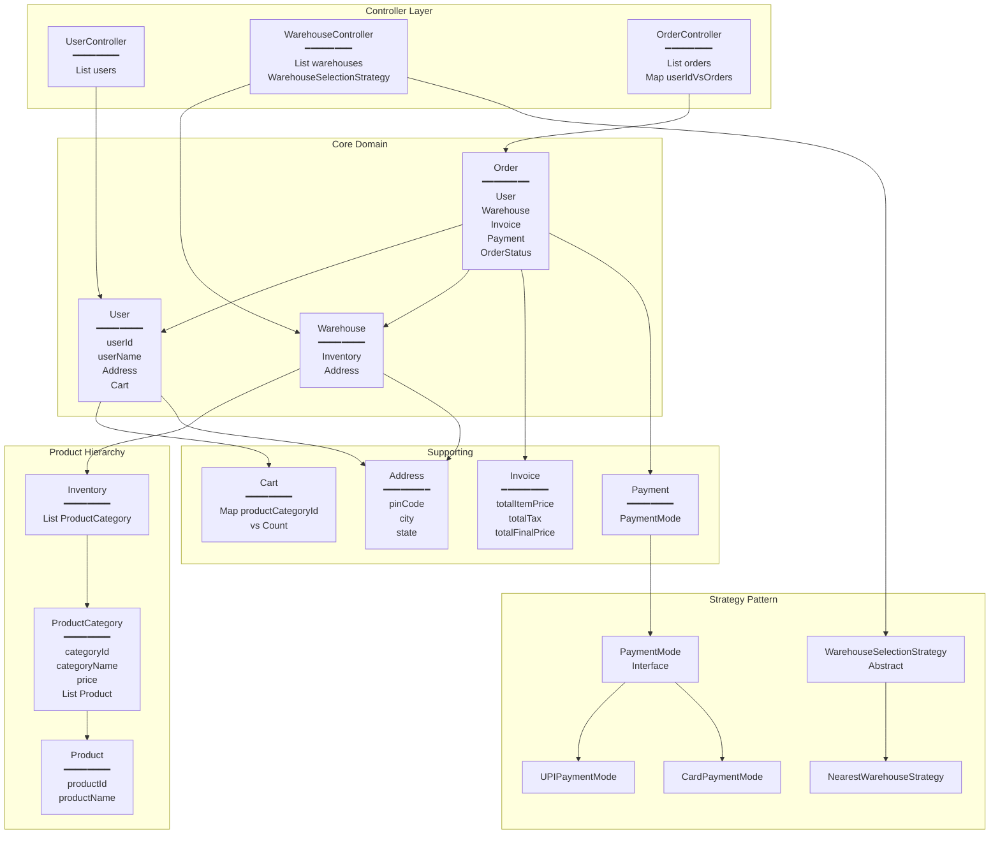
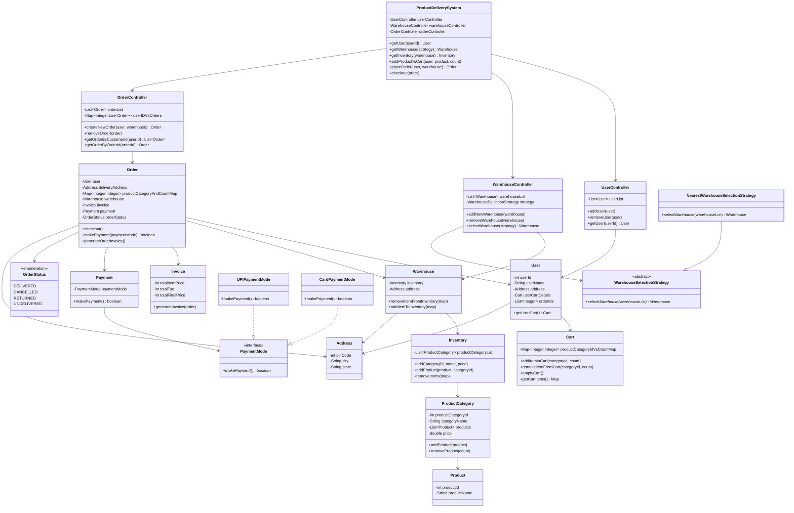
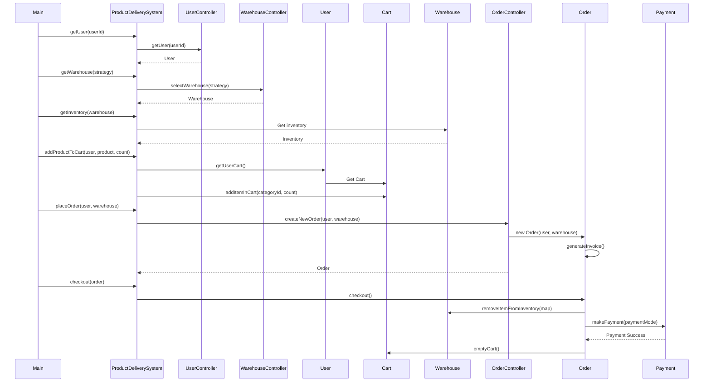
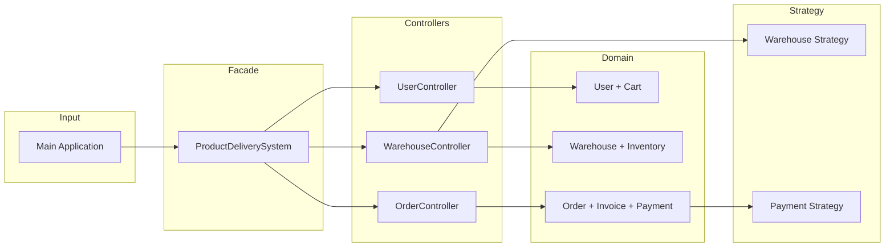
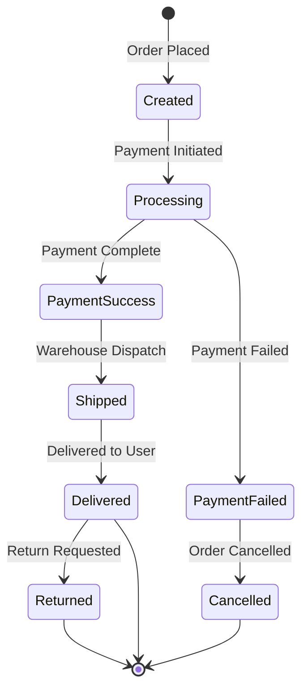

# Order Management System

## 📋 System Requirements

### Functional Requirements
1. **User Management**: System should manage multiple users with personal information and addresses
2. **Warehouse Management**: Support multiple warehouses with location-based inventory
3. **Product Catalog**: Organize products in categories with pricing
4. **Shopping Cart**: Users can add/remove items and manage cart before checkout
5. **Warehouse Selection**: Select optimal warehouse based on configurable strategies (e.g., nearest location)
6. **Order Processing**: Create orders from cart items with invoice generation
7. **Payment Processing**: Support multiple payment modes (UPI, Card, etc.)
8. **Inventory Management**: Real-time inventory updates on order placement
9. **Checkout Flow**: Complete transaction with payment verification and cart cleanup

### Non-Functional Requirements
- **Extensibility**: Easy to add new payment modes and warehouse selection strategies
- **Modularity**: Separation of concerns with controller pattern
- **Maintainability**: Clean architecture with design patterns

---

## 🗂️ Core Objects

| Object | Data | Description |
|--------|------|-------------|
| **User** | userId, userName, Address, Cart, orderIds | Customer entity with shopping cart |
| **Cart** | Map<ProductCategoryId, Count> | Manages items before order placement |
| **Warehouse** | Inventory, Address | Storage facility with stock |
| **Inventory** | List<ProductCategory> | Category-wise product organization |
| **ProductCategory** | categoryId, categoryName, List<Product>, price | Product grouping with pricing |
| **Product** | productId, productName | Individual product item |
| **Order** | User, Warehouse, productCategoryMap, Invoice, Payment, OrderStatus, Address | Complete transaction record |
| **Invoice** | totalItemPrice, totalTax, totalFinalPrice | Order billing information |
| **Payment** | PaymentMode | Payment processing handler |
| **Address** | pinCode, city, state | Location information |
| **OrderStatus** | DELIVERED, CANCELLED, RETURNED, UNDELIVERED | Order state enum |

---

## 🏗️ UML Diagrams

### System Architecture



### Class Diagram



### Sequence Diagram - Order Flow



### Component Flow Diagram



### State Diagram - Order Status



---

## 🎯 Design Patterns Used

### 1. Strategy Pattern
**Purpose**: Enable runtime selection of algorithms

**Implementation**:
- **Warehouse Selection**: `WarehouseSelectionStrategy` → `NearestWarehouseSelectionStrategy`
- **Payment Processing**: `PaymentMode` → `UPIPaymentMode`, `CardPaymentMode`

### 2. Facade Pattern
**Purpose**: Simplify complex subsystem interactions

**Implementation**: `ProductDeliverySystem` provides unified interface to UserController, WarehouseController, and OrderController

### 3. Controller Pattern
**Purpose**: Separate business logic from domain objects

**Implementation**: UserController, WarehouseController, OrderController manage their respective domains

---

## 📊 Key Relationships

| Relationship | From | To | Type |
|--------------|------|-----|------|
| Composition | User | Cart | Has-a |
| Composition | Warehouse | Inventory | Has-a |
| Composition | Inventory | ProductCategory | Has-a |
| Composition | ProductCategory | Product | Has-a |
| Composition | Order | Invoice | Has-a |
| Composition | Order | Payment | Has-a |
| Association | Order | User | References |
| Association | Order | Warehouse | References |
| Inheritance | NearestWarehouseSelectionStrategy | WarehouseSelectionStrategy | Is-a |
| Implementation | UPIPaymentMode | PaymentMode | Implements |
| Implementation | CardPaymentMode | PaymentMode | Implements |

---

## 🔄 Request-Response Flow

**Example**: Order 2 Pepsi Cold Drinks

```
Request Flow:
Main → ProductDeliverySystem → UserController → User (ID: 1)
                              ↓
                         WarehouseController → NearestWarehouseStrategy → Warehouse
                              ↓
                         Warehouse → Inventory → ProductCategory (Pepsi, ID: 0001)
                              ↓
                         Cart.addItem(0001, 2)
                              ↓
                         OrderController → Order(User, Warehouse)
                              ↓
                         Order.checkout()
                              ↓
                         Warehouse.removeInventory(0001, 2)
                              ↓
                         Payment.makePayment(UPI) → Success
                              ↓
                         Cart.emptyCart()
                              ↓
Response: Order Completed
```

---

## 🚀 Quick Start

```bash
# Run the application
java -cp target/classes com.order.management.system.Main
```

**Expected Output**: Order placed for 2 Pepsi items with invoice generation and payment processing.

---
